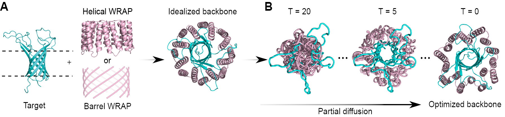

# WRAPs

Water-soluble RFdiffused Amphipathic Proteins (WRAPs)

## Description
WRAPs (Water-soluble RFdiffused Amphipathic Proteins) are genetically encoded de novo proteins that surround the lipid-interacting hydrophobic surfaces of transmembrane proteins, rendering them thermostable and water-soluble without the need for detergents. This repo includes scripts and inputs to generate WRAPs as described in the [WRAPs paper](https://www.biorxiv.org/content/10.1101/2025.02.04.636539v1).

## References
Ljubica Mihaljević et. al. Solubilization of Membrane Proteins using designed protein WRAPS. Submitted to Science. ([biorxiv](https://www.biorxiv.org/content/10.1101/2025.02.04.636539v1))

Yong Hyun Kwon et. al. Topological reprogramming transforms an integral membrane oligosaccharyltransferase into a water-soluble glycosylation catalyst ([biorxiv](https://www.biorxiv.org/content/10.64898/2026.01.30.702934v1))

## Table of Contents

* [Installation](#install)
  * [Submodules](#subs)
  * [Dependencies/Environment setup](#deps)
* [Generating WRAPs](#gwraps)
  * As described in the paper 
    * [helical](#helical)
    * [barrel](#barrel)   
  * A general parametric approach
    * [sushimaki](#sushimaki) 
* [Authors and acknowledgment](#auths)

## Installation 
You can install, set up, and run all the necessary software to generate WRAPs from the Google Colab Notebooks provided in this repo for [helical WRAPs](https://colab.research.google.com/github/davidekim/WRAPs/blob/main/helical_wraps.ipynb) and  [barrel WRAPs](https://colab.research.google.com/github/davidekim/WRAPs/blob/main/barrel_wraps.ipynb).

Alternatively, you can clone this repo into a preferred destination directory by going to that directory and then running:

`git clone https://github.com/davidekim/WRAPs.git`

### Submodules 

dl_binder_design https://github.com/nrbennet/dl_binder_design

ppi_iterative_opt https://github.com/davidekim/ppi_iterative_opt

#### To generate parametric barrel WRAPs

sushimaki https://github.com/davidekim/sushimaki

parametric barrels https://github.com/davidekim/parametric_barrels

Install submodules by running:

~~~
cd WRAPs
git submodule init
git submodule update --remote
~~~

Clone ProteinMPNN for dl_binder_design
~~~
cd submodules/dl_binder_design/mpnn_fr
git clone https://github.com/dauparas/ProteinMPNN.git
cd ../../../
~~~

Download AlphaFold2 model weights. 
~~~
cd submodules/dl_binder_design/af2_initial_guess
mkdir -p model_weights/params && cd model_weights/params
wget https://storage.googleapis.com/alphafold/alphafold_params_2022-12-06.tar
tar --extract --verbose --file=alphafold_params_2022-12-06.tar 
cd ../../../../ppi_iterative_opt/af2_initial_guess
ln -s ../../dl_binder_design/af2_initial_guess/model_weights/params .
cd ../../../
~~~

Install ppi_iterative_opt RFdiffusion checkpoints.
~~~
cd submodules/ppi_iterative_opt/rf_diffusion
mkdir models && cd models
wget https://files.ipd.uw.edu/pub/ppi_iterative_opt/rf_diffusion/models/BFF_4.pt
wget http://files.ipd.uw.edu/pub/RFdiffusion/60f09a193fb5e5ccdc4980417708dbab/Complex_Fold_base_ckpt.pt
cd ../../../../
~~~

### Dependencies/Environment setup 
It is recommended to create and use a [Conda](https://conda.io/projects/conda/en/latest/user-guide/install/index.html) environment with Anaconda or Miniconda first.
Note: Due to different GPU types, drivers, and future incompatibilities, this environment may not run on all setups.

~~~
pip install jedi omegaconf hydra-core icecream pyrsistent pynvml decorator
pip install git+https://github.com/NVIDIA/dllogger#egg=dllogger
pip install --no-dependencies dgl -f https://data.dgl.ai/wheels/torch-2.4/cu124/repo.html
pip install --no-dependencies e3nn==0.5.5 opt_einsum_fx
pip install biopython==1.81
pip install -U dm-haiku
pip install ml-collections
pip install --upgrade "jax[cuda12_pip]<0.6.0" -f https://storage.googleapis.com/jax-releases/jax_cuda_releases.html
cd submodules/ppi_iterative_opt/rf_diffusion/env/SE3Transformer; pip install .; cd ../../../../../
pip install --upgrade pybiolib
pip install pyrosetta --find-links https://west.rosettacommons.org/pyrosetta/quarterly/release
export DGLBACKEND="pytorch"
export PATH="$PATH:$(pwd)/submodules/ppi_iterative_opt/rf_diffusion"
~~~

## Generating WRAPs 
We recommend using the Google Colab Notebooks provided in this repo for [helical WRAPs](https://colab.research.google.com/github/davidekim/WRAPs/blob/main/helical_wraps.ipynb) and  [barrel WRAPs](https://colab.research.google.com/github/davidekim/WRAPs/blob/main/barrel_wraps.ipynb). For a general method that makes WRAPs parametrically around a target protein you can use the [sushimaki](https://colab.research.google.com/github/davidekim/sushimaki/blob/main/sushimaki.ipynb) Google Colab Notebook. 

For reproducing designs presented in the [WRAPs paper](https://www.biorxiv.org/content/10.1101/2025.02.04.636539v1), this repo provides directories containing inputs and commands to run RFdiffusion inference to generate backbone WRAPs and WRAPed designs for each target, with the exception of OmpA_betabarrel_WRAP which requires [downloading and extracting](#barrel_inputs) a .tar.gz file containing the inputs. 

For all targets, with the exception of MspA which uses tied positions to enforce symmetry at the MPNN sequence design stage, the [previously described](https://www.nature.com/articles/s41467-023-38328-5) protein binder design pipeline, [dl_binder_design](https://github.com/nrbennet/dl_binder_design), was used on each RFDiffused backbone for sequence design and Alphafold2 validation. The script to run tied MPNN on WRAPed MspA RFDiffused backbones is provided in this repo.

### helical 
[Google Colab Notebook for helical WRAPs](https://colab.research.google.com/github/davidekim/WRAPs/blob/main/helical_wraps.ipynb)

Directories containing inputs and commands used for the paper

* C8 - For C8 symmetric helical inputs for RFdiffusion loop building to generate h16 WRAPs
* helix_WRAP_OmpA - For helical WRAPed OmpA
* PB0027_TP0733 - For helical WRAPed TP0733
* PB0073_TP0126 - For helical WRAPed TP0126
* PB0110_TP0698 - For helical WRAPed TP0698
* WRAP_GlpG - For helical WRAPed GlpG
* miniCXCR4 - For helical WRAPed miniCXCR4
* WRAP_MspA - For hleical WRAPed MspA

### barrel 
[Google Colab Notebook for barrel WRAPs](https://colab.research.google.com/github/davidekim/WRAPs/blob/main/barrel_wraps.ipynb)

Directory containing inputs and commands used for the paper

* OmpA_betabarrel_WRAP - For barrel WRAPed OmpA

Download and extract inputs and outputs 
~~~
cd OmpA_betabarrel_WRAP
wget http://files.ipd.uw.edu/pub/WRAPs/OmpA_betabarrel_WRAP/OmpA_betabarrel_WRAP_inputs_outputs.tar.gz
tar -zxvf OmpA_betabarrel_WRAP_inputs_outputs.tar.gz
cd ../
~~~

### sushimaki 
[Google Colab Notebook for parametric WRAPs](https://colab.research.google.com/github/davidekim/sushimaki/blob/main/sushimaki.ipynb)

For helical input WRAPs
~~~
python ./submodules/sushimaki/sushimaki.py <target pdb to wrap>
~~~

For beta barrel input WRAPs
~~~
python ./submodules/sushimaki/sushimaki.py --barrel <target pdb to wrap>
~~~

For RF partial diffusion backbone refinement of sushimaki WRAPs, ProteinMPNN sequence design, and Alphafold2 validation
~~~
python ./submodules/ppi_iterative_opt/ppi_iterative_opt.py *_WRAP_*pdb
~~~

## Authors and acknowledgment 
This work was conceptualized and developed by David Kim (dekim@uw.edu), Ljubica Mihaljevic (ljubim@uw.edu), Pooja Bandawane (banda14@uw.edu) and Helen Eisenach (heisen@uw.edu)

