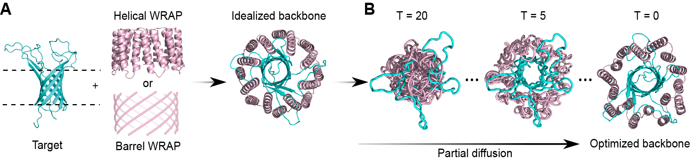

# WRAPs

Water-soluble RFdiffused Amphipathic Proteins (WRAPs)

## Description
WRAPs (Water-soluble RFdiffused Amphipathic Proteins) are genetically encoded de novo proteins that surround the lipid-interacting hydrophobic surfaces of transmembrane proteins, rendering them thermostable and water-soluble without the need for detergents. This repo includes scripts and inputs to generate WRAPs as described in the [WRAPs paper](https://www.biorxiv.org/content/10.1101/2025.02.04.636539v1).

## Reference
Ljubica Mihaljević et. al. Solubilization of Membrane Proteins using designed protein WRAPS. Submitted to Science.

## Installation
You can install, setup, and run all the necessary software to generate WRAPs from Google Colab Notebooks for [helical WRAPS](https://colab.research.google.com/github/davidekim/WRAPs/blob/main/helical_wraps.ipynb) and for [barrel WRAPS](https://colab.research.google.com/github/davidekim/WRAPs/blob/main/barrel_wraps.ipynb).

You can clone this repo into a preferred destination directory by going to that directory and then running:

